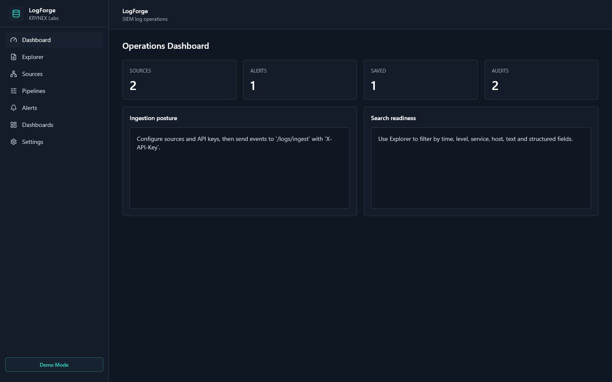
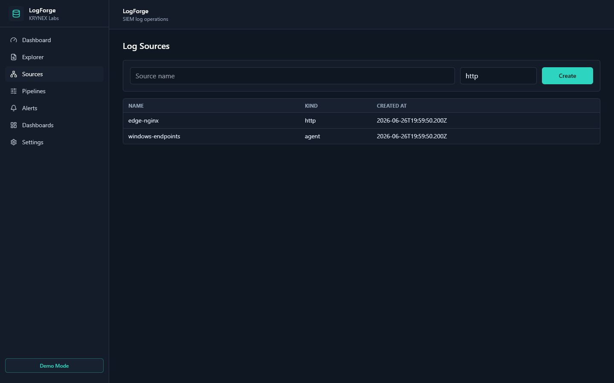
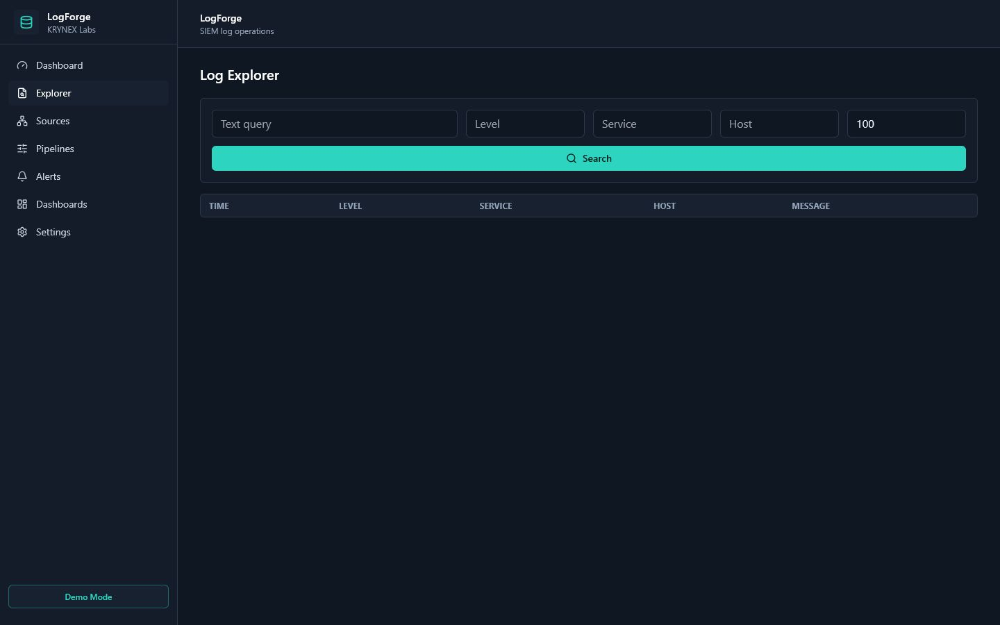
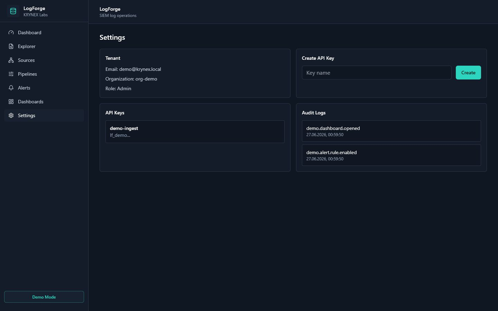

# LogForge V1.0
SIEM-style log operations dashboard for collecting, searching and reviewing defensive telemetry.

## Product Overview

LogForge is a public MVP/portfolio version of a KRYNEX Labs log management product. It shows the architecture and dashboard workflow for sources, pipelines, alert rules, saved searches and audit events. The public demo is not a production SIEM and should not be treated as a hardened deployment.

## Key Features

- Log source inventory and ingestion API pattern.
- Explorer view for filtering logs by service, host, level and text.
- Alert rule and saved search management screens.
- Audit log visibility for operator actions.
- Demo-mode dashboard preview without forcing registration.

## Architecture

React/Vite frontend talks to a FastAPI backend. PostgreSQL stores tenants, users, rules and metadata. ClickHouse is used for event storage. Redis supports background workflows.

## Tech Stack

- Frontend: React, TypeScript, Vite, TailwindCSS
- Backend: FastAPI, SQLAlchemy, Alembic
- Data: PostgreSQL, ClickHouse, Redis
- Packaging: Docker Compose

## Screenshots



| List view | Detail view | Settings |
| --- | --- | --- |
|  |  |  |

## Quick Start

```bash
cp .env.example .env
docker compose up --build
```

Frontend: <http://localhost:5173>  
API: <http://localhost:8000/docs>

## Demo Mode

Set `DEMO_MODE=true` and `VITE_DEMO_MODE=true` for public demos. Demo mode allows dashboard preview and uses demo-safe local configuration. It does not send SMTP mail or require email verification.

## Public Demo Readiness

- Keep demo log events synthetic and avoid customer-like identifiers.
- Disable or clearly scope ingestion keys before exposing hosted demos.
- Label alert rules and saved searches as portfolio examples.
- Use short-lived demo storage for public walkthrough environments.

## Environment Variables

Copy `.env.example` and override values locally. Do not commit real `.env` files. Important variables include `DEMO_MODE`, `SECRET_KEY`, `DATABASE_URL`, `REDIS_URL`, `CLICKHOUSE_*`, `CORS_ORIGINS` and `VITE_DEMO_MODE`.

## API Overview

- `POST /auth/login` - normal local login when demo mode is off.
- `POST /auth/register` - local tenant creation for non-demo development.
- `GET /me` - current user.
- `/log-sources`, `/alert-rules`, `/saved-searches`, `/audit-logs` - public MVP resource APIs.

## Project Structure

```text
backend/      FastAPI API and data models
clickhouse/   ClickHouse initialization SQL
frontend/     React dashboard
docker-compose.yml
```

## Security Scope

LogForge is defensive-only. It is intended for log collection, search, alerting and audit review. It does not include exploit code, credential theft, stealth, persistence, unauthorized control or destructive behavior.

## Roadmap

### Already implemented

- FastAPI and React public demo for sources, alert rules, saved searches and audit logs.
- C++ log normalizer path with safe Python fallback and cached ClickHouse client usage.
- C++ ingestion field extractor for service, host, trace and request metadata in log lines.
- C++ query preset generator for errors, warnings, auth and slow API investigation views.
- C++ retention policy helper for audit, debug and security telemetry tiers.
- C++ log-level route helper for incident, review and low-cost streams.
- Production guards for secrets, CORS, debug mode and demo isolation.
- Health and forced-normalizer smoke checks for the C++ acceleration path.

### Will be implemented

- Richer synthetic SOC demo data for sources, alerts and audit events.
- Saved dashboard widgets backed by query presets, route previews and retention policies.
- Role-limited public demo controls and hosted read-only profile.
- Expanded query workflow tests and ClickHouse integration checks.

## KRYNEX Ecosystem

LogForge complements SentinelX endpoint telemetry, ThreatVault file analysis and VulnScope exposure management. KRYNEX Nexus is planned as a future private control plane.

## License

MIT.
<!-- Project version: LogForge V1.0 -->


